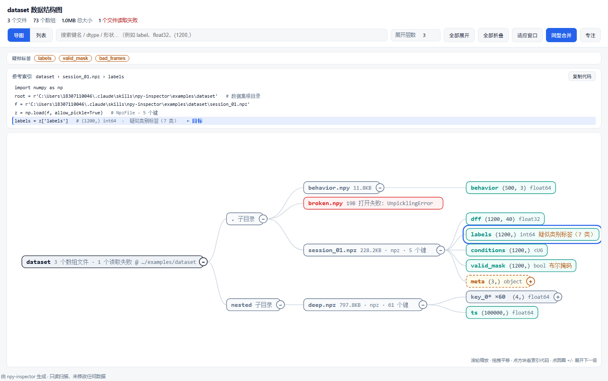

# npy-inspector

Turn an opaque folder of `.npy` / `.npz` files into a structure map you can read
at a glance — an interactive HTML mind map, a static PNG, and a JSON schema.

Built for the case where you did **not** create the dataset and there is no
README: the tool has to discover the organization itself. It recurses into npz
keys, object arrays, and nested dicts/lists, so you can see what each array
holds, its shape/dtype/range, and which arrays look like labels.



<sub>Interactive map. Click any box and the 参考索引 bar above it gives the
copy-pasteable Jupyter code that reaches that level.</sub>

---

## Why

`data.npz` tells you nothing. `np.load(f).files` gives you a list of 12 key
names and no idea which one is the main data tensor, which is the labels, or
which one is a `(3,)` object array that secretly holds three dicts of further
arrays. Answering that by hand means a loop of `print(k, v.shape, v.dtype)`,
and it breaks the moment something is `dtype=object`.

This does that loop properly, recursively, and draws the result.

## Install

**As a Claude Code skill** — clone it into your skills directory:

```bash
git clone https://github.com/ts728728/npy-inspector ~/.claude/skills/npy-inspector
```

Then just ask: *"I have a folder of npy/npz on drive D, show me its structure."*
Claude picks up the skill from `SKILL.md` and runs it.

**As a plain script** — no install, no package:

```bash
python scripts/inspect_npy.py /path/to/dataset
```

Requires Python 3 and `numpy`. [matplotlib](https://matplotlib.org/) is optional
— it is only needed for the PNG; the HTML and JSON are produced without it.
No Graphviz.

## Usage

```bash
python scripts/inspect_npy.py <path> [flags]
```

`<path>` is a directory (scanned recursively) or a single `.npy`/`.npz` file.
Outputs land in `<name>_structure_map/` next to the dataset.

Run it from a terminal and it opens the HTML for you; run it with the output
piped or redirected and it stays quiet, so it drops into a script cleanly.

| Flag | Meaning |
|---|---|
| `--out DIR` | Write elsewhere (e.g. your Desktop). |
| `--max-depth N` | Recursion ceiling into object arrays / dicts (default 6). Raise for deeply nested session structs. |
| `--max-items N` | Children expanded per node (default 25). Raise if a dict has 60 keys and you need them all. |
| `--max-files N` | Cap on files scanned (default 400). |
| `--no-pickle` | Refuse object arrays. **Safer, but nested structures go unexpanded** — only use on untrusted data. |
| `--formats html,png,json` | Which artifacts to produce. Drop the PNG when you don't need a document-ready image. |
| `--collapse N` | PNG only: merge runs of ≥N identically-shaped leaf siblings into one row (default 8, `0` disables). |
| `--open html\|png\|all\|none` | Pop the result open when done. Default `auto`: opens the HTML only when stdout is a terminal. |

## What you get

| File | Use |
|---|---|
| `<name>_structure_map.html` | **Primary artifact.** Self-contained, no CDN, works offline. An interactive mind map (circles fold/unfold one level, wheel-zoom, drag-pan, click to select) plus a flat list view. Both share the search box, the depth control, and the index bar. |
| `<name>_structure_map.png` | Static map — rounded node boxes, bezier links, kind legend. For embedding into a `.docx` or slides. |
| `<name>_structure_map.json` | Machine-readable schema. Feed it to an assistant to answer follow-ups without re-scanning. |

Opening `<name>_structure_map.html#list` starts in the list view instead of the
map.

## Reading the output

**Colour carries meaning, never decoration.** There are only four accent
families on purpose:

| Colour | Kind |
|---|---|
| teal | data array |
| amber | `object_array` — a leaf that hides a tree |
| violet | nested `dict` / `list` |
| red | read failure |

Every container (`root`, `folder`, `file`, `scalar`) shares one neutral slate,
so the structure reads as a single skeleton instead of a rainbow.

- **`object_array` is the interesting one.** It is what makes naive inspection
  fail: `arr.shape` tells you nothing, you have to index into it. Its box is
  **dashed** to read as "looks like a leaf, hides a tree", and the element type
  composition is reported in `stats.element_types`.
- **`疑似类别标签` hints** come from a heuristic: integer/bool dtype, `ndim <= 2`,
  and 2–50 unique values. Treat it as a *lead, not a fact* — check the unique
  values before trusting it.
- **Statistics are trimmed** to what the shape/dtype line doesn't already say.
  `（抽样统计）` means the array was too big to fully reduce, so min/max/mean came
  from a strided subsample. Shape and dtype are always exact.
- **同型合并 (on by default).** A run of ≥8 *siblings* with an identical shape and
  dtype folds into one `key_0* ×60` row that still opens to all 60. Without it,
  a file of 60 same-shaped keys is 60 rows of nothing to read. Only leaf arrays
  qualify — two dicts both labelled `dict · 3 键` can hold completely different
  things, so folding them would claim a sameness that isn't there.

### The 参考索引 bar

Selecting any box fills the bar above the diagram with the Python you would
type in a Jupyter cell to reach that exact level, plus a 复制代码 button. The
last line is marked `← 目标`. It exists to remove the step where you see an
array name in the diagram and then have to go write `np.load(...)['...']` by
hand.

## Safety

- **Read-only.** It never writes into the dataset directory; every output goes
  to a separate `<name>_structure_map/` folder.
- **`allow_pickle=True` is the default**, because object arrays are otherwise
  invisible — and that means scanning will execute whatever pickled objects the
  npz constructs. Only run it on data you trust. Use `--no-pickle` on anything
  of unknown origin.

## Examples

`examples/` contains a small synthetic dataset (3 files, 73 arrays) and the
outputs generated from it, so you can see what the tool produces before
pointing it at your own data:

```bash
python scripts/inspect_npy.py examples/dataset --out /tmp/demo
```

It deliberately includes an `object` array of dicts, a 61-key nested npz, and
one corrupt file.

## License

MIT — see [LICENSE](LICENSE).

---

# 中文说明

把一个装满 `.npy` / `.npz` 的文件夹，变成一眼能看懂的结构图：可交互的 HTML
思维导图、静态 PNG、机器可读的 JSON。

它是为「**数据集不是你建的，也没有 README**」这种情况写的——工具必须自己把
组织结构发现出来。它会递归进 npz 的键、object 数组、嵌套的 dict/list，让你看到
每个数组装的是什么、形状 / dtype / 取值范围，以及哪些数组看着像标签。


## 为什么需要它

`data.npz` 本身什么也告诉不了你。`np.load(f).files` 只给你一串键名，你不知道
哪个是主数据、哪个是标签、哪个是形状 `(3,)` 的 object 数组背后还藏着三个 dict。
手工搞就是一遍遍 `print(k, v.shape, v.dtype)`，而且一旦碰上 `dtype=object` 就彻底
失效。

这个东西把这个循环做对了、做全了，并且把结果画出来。

## 安装

**作为 Claude Code 技能**：

```bash
git clone https://github.com/ts728728/npy-inspector ~/.claude/skills/npy-inspector
```

然后直接说：「我 D 盘某个文件夹里有一批 npy 和 npz，帮我看看数据结构」。
Claude 会从 `SKILL.md` 识别这个技能并自动调用。

**当普通脚本用**——不需要安装，没有打包：

```bash
python scripts/inspect_npy.py /你的/数据集/路径
```

依赖 Python 3 和 `numpy`。[matplotlib](https://matplotlib.org/) 是可选的，只有
生成 PNG 才需要，HTML 和 JSON 没有它也能出。不需要 Graphviz。

## 用法

```bash
python scripts/inspect_npy.py <路径> [参数]
```

`<路径>` 可以是目录（递归扫描）或单个 `.npy`/`.npz` 文件。产物落在数据集旁边的
`<名字>_structure_map/` 里。

在终端里跑会自动打开 HTML；输出被管道或重定向接走就不弹窗，可以安静地嵌进脚本。

| 参数 | 说明 |
|---|---|
| `--out DIR` | 输出到别处（比如桌面）。 |
| `--max-depth N` | 向 object 数组 / dict 递归的深度上限，默认 6。嵌套很深的 session 结构可以调大。 |
| `--max-items N` | 每个节点展开多少个子项，默认 25。某个 dict 有 60 个键、你想全看到时就调大。 |
| `--max-files N` | 最多扫多少个文件，默认 400。 |
| `--no-pickle` | 拒绝 object 数组。**更安全，但嵌套结构就展不开了**——只对来源不可信的数据用。 |
| `--formats html,png,json` | 要生成哪些产物。不需要图片时去掉 png。 |
| `--collapse N` | 仅 PNG：把 ≥N 个形状相同的兄弟数组合并成一行，默认 8，`0` 关闭。 |
| `--open html\|png\|all\|none` | 跑完自动打开。默认 `auto`——只在 stdout 是终端时打开 HTML。 |

## 生成什么

| 文件 | 用途 |
|---|---|
| `<名字>_structure_map.html` | **主要产物。** 单文件、无 CDN、可离线。交互式导图（圆圈逐级折叠/展开、滚轮缩放、拖拽平移、点击选中）加一个平铺列表视图。两个视图共用搜索框、展开层数和参考索引栏。 |
| `<名字>_structure_map.png` | 静态结构图。圆角节点框、贝塞尔连线、图例。用来插进 Word / PPT。 |
| `<名字>_structure_map.json` | 机器可读的完整 schema。喂给 AI 就能接着回答后续问题，不用重扫。 |

打开 `<名字>_structure_map.html#list` 会直接进入列表视图。

## 怎么读这张图

**颜色只承担信息，不做装饰。** 只有四类强调色：

| 颜色 | 类型 |
|---|---|
| 青绿 | 数据数组 |
| 琥珀 | `object_array`——看着像叶子，其实藏着一棵树 |
| 紫 | 嵌套 `dict` / `list` |
| 红 | 读取失败 |

根节点、目录、文件、标量统一用同一种中性灰蓝，让骨架读起来是一体的，而不是一道彩虹。

- **`object_array` 是重点。** 它就是让「直接看 shape」失效的东西：`arr.shape`
  什么也告诉不了你，必须索引进去。它的框是**虚线**的，意思是「看着像叶子，其实
  藏着一棵树」，元素类型构成在 `stats.element_types` 里。
- **`疑似类别标签` 只是线索，不是结论**——判断依据是整数或布尔 dtype、`ndim <= 2`、
  唯一值在 2~50 个之间。请对着唯一值列表确认再相信它。
- **统计量只保留 shape/dtype 没说过的信息。** 出现 `（抽样统计）` 说明数组太大没法
  完整统计，min/max/mean 来自等距抽样；形状和 dtype 永远是准确的。
- **同型合并（默认开启）**：≥8 个形状和 dtype 完全相同的兄弟合并成一行
  `key_0* ×60`，点开还是全部 60 个。没有它，一个 60 个同型键的文件就是 60 行
  什么也看不出来的东西。**只有叶数组会被合并**——两个 dict 都写着 `dict · 3 键`，
  内容可能完全不同，合并等于谎报它们的相似性。

### 参考索引栏

选中任意方块，上方就会给出在 Jupyter 里索引到这一层的完整代码，最后一行标着
`← 目标`，旁边有「复制代码」。它省掉的是「在导图里看到一个数组名，然后回 notebook
里从头手写 `np.load(...)['...']`」这一步。

## 安全

- **只读。** 从不往数据集目录里写任何东西，所有产物都落在单独的
  `<名字>_structure_map/` 里。
- **`allow_pickle=True` 是默认值**，因为否则 object 数组完全不可见——这也意味着
  扫描会执行 npz 里 pickle 进来的对象构造代码。**只对你自己信得过的数据用**；
  来源不明的数据请加 `--no-pickle`。

## 示例

`examples/` 里有一份很小的合成数据集（3 个文件 / 73 个数组）和它生成的产物，
你可以先看看这个工具产出什么，再拿去扫自己的数据：

```bash
python scripts/inspect_npy.py examples/dataset --out /tmp/demo
```

里面故意包含了一个装着 dict 的 object 数组、一个 61 键的嵌套 npz，和一个损坏的文件。

## 许可证

MIT，见 [LICENSE](LICENSE)。
